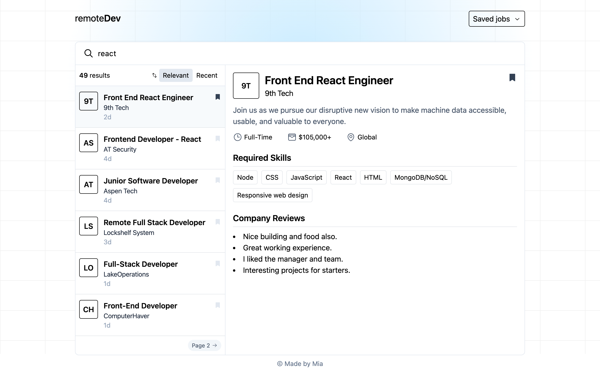

# remoteDev

> Remote job platform for developers using React

  

## Tech Stacks

- **Framework**: [React](https://react.dev/)
- **Language**: [TypeScript](https://www.typescriptlang.org/)
- **Styling**: [Tailwind CSS](https://tailwindcss.com/)
- **Iconography**: [Radix Icons](https://www.radix-ui.com/icons)
- **Data Fetching**: [React Query @4.36.1](https://www.npmjs.com/package/@tanstack/react-query)
- **Toast**: [Sonner](https://sonner.emilkowal.ski/)

## Features

- 🔍 Search jobs
- ⭐ Bookmark jobs
- ⇅ Sorting jobs
- 📃 Pagination
- 👀 View all bookmarked jobs
